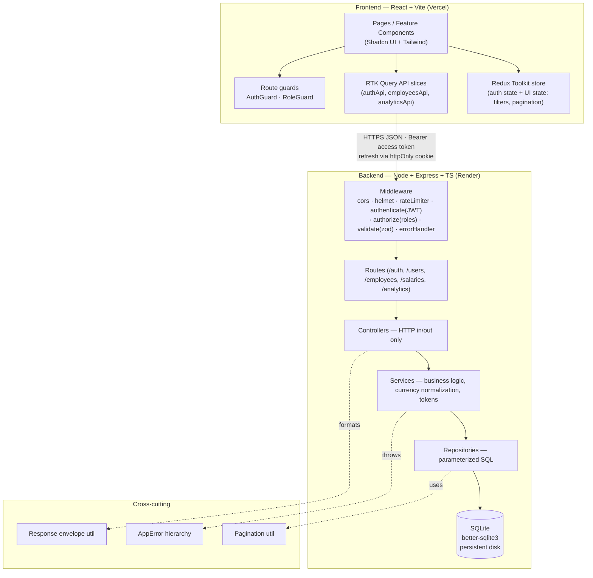
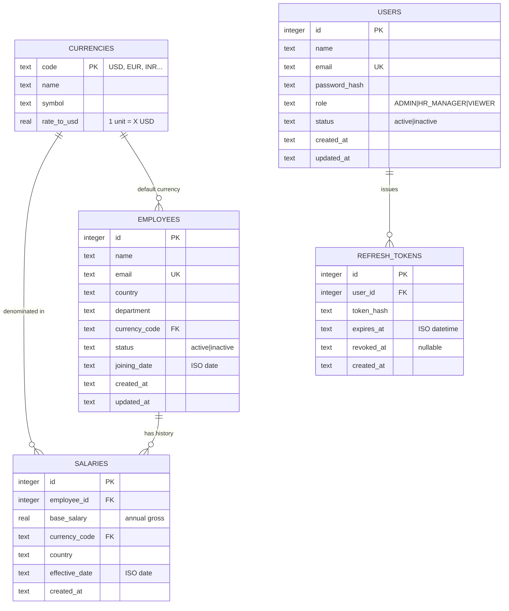
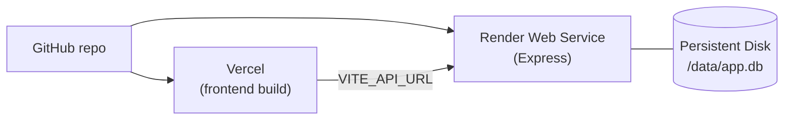

# ACME Salary Management — Architecture & Execution Plan

> Companion to [REQUIREMENTS.md](./REQUIREMENTS.md). Covers the architecture
> principles, system/database/API design, testing, deployment, AI usage, risks, and
> the phase-wise execution + git commit plan.
>
> **Status: design approved-pending. No implementation has started.**

---

## 1. Architecture Principles & Decisions

The system is built on a small set of deliberate principles that keep it clean,
testable, and maintainable at a scale of ~10,000 employees.

### Backend principles

| Principle | Decision |
|---|---|
| **Strict layering** | `Route → Controller → Service → Repository → SQLite`. Each layer has one responsibility; dependencies point inward only. |
| **Module-per-domain** | Each domain (`auth/`, `users/`, `employees/`, `salaries/`, `analytics/`) owns its controller, routes, service, repository, validation, and types. Clear boundaries, easy to navigate. |
| **Repository pattern** | All SQL lives in repositories returning typed rows. Keeps services pure and lets us test data access against in-memory SQLite. |
| **Stateless auth + RBAC** | Short-lived **JWT access tokens** authorize each request via an `authenticate` middleware; an `authorize(...roles)` middleware enforces **role-based access control**. **Refresh tokens** (httpOnly cookie) are rotated and revocable server-side. |
| **Consistent response envelope** | Every response is `{success, data, meta?}` or `{success, error:{code, message, details?}}`. One predictable contract for the client. |
| **Centralized error handling** | A custom error hierarchy (`AppError`, `NotFoundError`, `ValidationError`, `ConflictError`) thrown anywhere, caught by one `errorHandler` middleware that maps to status codes + envelope. |
| **Validation at the edge** | A `validate(zodSchema)` middleware checks body/query/params before handlers run, returning `422` with field-level details. Zod schemas double as request types. |
| **Reusable pagination** | A shared pagination utility returns `{page, limit, total, totalPages, hasNext, hasPrev}` — directly serving fast listing over 10k rows. |
| **Validated configuration** | Environment is parsed/validated with Zod at boot (`config/env.ts`); the app fails fast on misconfiguration. |

### Frontend principles

| Principle | Decision |
|---|---|
| **Feature-based structure** | Each feature (`employees`, `salaries`, `analytics`) co-locates its `api/`, `components/`, `pages/`, and `types/`. Code that changes together lives together. |
| **RTK Query for server state** | A shared `baseQuery` + per-feature API slices handle fetching, caching, and the loading/error states; Redux Toolkit holds only UI state (filters, pagination). |
| **Shared layer for cross-cutting** | Layout, Shadcn UI primitives, hooks, and common types live in shared locations to prevent duplication. |
| **Explicit UI states** | Every data view renders distinct loading / empty / error / data states. |

---

## 2. System Architecture



**Layer responsibilities (clean architecture):**

- **Controller** — parse validated request, call service, format response via the
  envelope util. No business logic, no SQL.
- **Service** — business rules: currency conversion, "current salary = latest
  effective record", distribution bucketing, orchestration. Unit-testable with a
  mocked repository.
- **Repository** — the only place that writes SQL; returns typed rows. Tested against
  in-memory SQLite.
- **Validator (Zod)** — request schemas + the `validate` middleware; single source of
  truth for request types.
- **Auth middleware** — `authenticate` verifies the JWT access token and attaches
  `req.user`; `authorize(...roles)` runs after it to enforce RBAC per route.

**Authentication & token flow**

1. **Login** (`POST /auth/login`) → verify password (bcrypt) → issue a short-lived
   **access token** (JWT, ~15 min, returned in the body) and a long-lived
   **refresh token** (~7 days, set as an httpOnly, secure, sameSite cookie). A hash of
   the refresh token is stored in `refresh_tokens` for revocation.
2. **Authorized requests** send `Authorization: Bearer <access token>`. `authenticate`
   verifies it; `authorize(...roles)` checks the user's role.
3. **Refresh** (`POST /auth/refresh`) uses the cookie → validates against the stored
   hash → **rotates** it (old token revoked, new one issued). Reuse of a revoked token
   triggers revocation of the session (reuse detection).
4. **Logout** (`POST /auth/logout`) revokes the refresh token and clears the cookie.

On the client, the RTK Query `baseQuery` attaches the access token from state and, on a
`401`, transparently calls `/auth/refresh` once and retries; if refresh fails the user
is sent to login.

**Key decisions & tradeoffs**

| Decision | Choice | Tradeoff |
|---|---|---|
| SQLite driver | **`better-sqlite3`** (synchronous) | Simpler, faster for 10k rows, trivial `:memory:` tests. Loses async I/O — irrelevant at this scale/single node. |
| Auth model | **JWT access + rotating refresh (httpOnly cookie) + RBAC** | Stateless authorization with revocable sessions; more moving parts than a single gate. Roles stored as an enum column + a permissions matrix in code (roles/permissions tables noted as a future option). |
| Password hashing | **bcrypt** (argon2 alternative) | Battle-tested, simple; CPU cost tuned via rounds. |
| Data access | **Hand-written SQL in repositories** (Drizzle noted as alternative) | Shows fundamentals + full control over aggregations; more boilerplate than an ORM. |
| Cross-currency totals | **Normalize to USD via `currencies.rate_to_usd`** at query time | Makes "total payroll" meaningful. Rates seeded/static (live FX out of scope). |
| Current salary | **`salaries` history table + `v_current_salary` view** | Clean history; view keeps listing/sorting simple. Fallback: denormalize `current_salary_usd` onto `employees` if sort-by-salary slows. |
| Salary semantics | **Store `base_salary` as annual gross**; monthly = /12 | One canonical unit avoids aggregate ambiguity. |
| Migrations | **Tiny ordered, idempotent SQL migration runner** | Explicit and reviewable; no heavy ORM tooling. |

---

## 3. Database Design



**Indexes (fast search/filter/sort at 10k):**

- `employees(email)` UNIQUE
- `employees(country)`, `employees(department)`, `employees(status)` — filters
- `employees(name)` — search (`LIKE 'term%'`; FTS5 noted as upgrade)
- `salaries(employee_id, effective_date DESC)` — history + current-salary view
- `users(email)` UNIQUE — login lookup
- `refresh_tokens(token_hash)`, `refresh_tokens(user_id)` — refresh validation + revocation
- View `v_current_salary` → latest salary per employee, exposing
  `base_salary_usd = base_salary * rate_to_usd`

**PRAGMAs:** `journal_mode=WAL`, `foreign_keys=ON`.

**Notes:** `country`/`department` kept as indexed text (lookup tables would be
over-normalization at this scale). FX *must* be a table because aggregation depends
on conversion.

---

## 4. API Design

Base path `/api/v1`. All responses use the envelope
`{success, data, meta?}` / `{success, error}`. The **Auth** column shows the required
role; **Public** = no token, **Any** = any authenticated user.

**Auth & Users**

| Method | Path | Purpose | Auth | Body / Notes |
|---|---|---|---|---|
| POST | `/auth/login` | Email + password → access token + refresh cookie | Public | `{email, password}` |
| POST | `/auth/refresh` | Rotate refresh token, issue new access token | Cookie | refresh via httpOnly cookie |
| POST | `/auth/logout` | Revoke refresh token, clear cookie | Any | — |
| GET | `/auth/me` | Current authenticated user | Any | — |
| GET | `/users` | List users | Admin | paginated |
| POST | `/users` | Create user + assign role | Admin | `{name,email,password,role}` |
| PATCH | `/users/:id` | Update role / status / deactivate | Admin | partial user |

**Employees, Salaries, Analytics** (all require a valid access token)

| Method | Path | Purpose | Auth | Query / Body |
|---|---|---|---|---|
| GET | `/employees` | List + search + filter + sort + paginate | Any | `search, country, department, status, sort(name\|salary\|joining_date), order, page, limit` |
| GET | `/employees/:id` | Detail (+ current salary) | Any | — |
| POST | `/employees` | Create (+ initial salary) | HR Manager | `{name,email,country,department,currency_code,joining_date,base_salary,effective_date}` |
| PATCH | `/employees/:id` | Update fields | HR Manager | partial employee |
| GET | `/employees/:id/salaries` | Salary history (desc) | Any | — |
| POST | `/employees/:id/salaries` | Add salary record (raise) | HR Manager | `{base_salary,currency_code,effective_date}` |
| GET | `/analytics/summary` | Total/avg/min/max payroll, headcount (USD) | Any | — |
| GET | `/analytics/by-country` | Payroll + avg + headcount per country | Any | — |
| GET | `/analytics/by-department` | Payroll + avg + headcount per department | Any | — |
| GET | `/analytics/distribution` | Salary band histogram | Any | `buckets?` |
| GET | `/analytics/top-earners` | Top-N highest paid | Any | `limit=10` |
| GET | `/health` | Liveness | Public | — |

> `Any` = any authenticated role (Admin / HR Manager / Viewer). `HR Manager` write
> access is also available to `Admin` (roles are hierarchical for write operations).

---

## 5. Folder Structures

**Backend** (module-per-domain + Repository layer)

```
backend/src/
├─ modules/
│  ├─ auth/        auth.controller|service|repository|validation|types.ts
│  ├─ users/       user.controller|service|repository|validation|types.ts
│  ├─ employees/   employee.controller|service|repository|validation|types.ts
│  ├─ salaries/    salary.controller|service|repository|validation|types.ts
│  └─ analytics/   analytics.controller|service|repository|types.ts
├─ routes/index.ts
├─ middleware/     authenticate · authorize · validate · errorHandler · notFoundHandler · rateLimiter
├─ database/       connection.ts · migrations/ · views.sql · seed.ts
├─ shared/
│  ├─ errors/      AppError · NotFoundError · ConflictError · ValidationError · UnauthorizedError · ForbiddenError
│  └─ utils/       response.utils · pagination.utils · currency.utils · jwt.utils · password.utils
├─ config/         env.ts (zod) · logger.ts
├─ app.ts · server.ts
└─ tests/          unit (services) · integration (supertest) · repo (:memory:)
```

**Frontend** (feature-based structure)

```
frontend/src/
├─ app/            store.ts · hooks.ts · router.tsx · providers.tsx
├─ features/
│  ├─ auth/        api/ components/ pages/ store/ (auth slice) types/
│  ├─ users/       api/ components/ pages/ types/   (Admin only)
│  ├─ employees/   api/ components/ pages/ types/   (filter slice)
│  ├─ salaries/    api/ components/ types/
│  └─ analytics/   api/ components/ pages/ types/
├─ pages/          route-level shells
├─ components/     shared + ui/ (Shadcn) + guards/ (AuthGuard · RoleGuard)
├─ layouts/        AppShell · Header (user menu) · Sidebar
├─ services/       baseQuery.ts (attaches access token, refresh-on-401)
├─ hooks/          useDebounce · useToast · useAuth
├─ store/          rootReducer / UI slices
├─ types/          api.types · common.types
└─ tests/          component (RTL) · slice · MSW handlers
```

---

## 6. Testing Strategy

| Layer | Tool | What |
|---|---|---|
| Repository | Vitest + `:memory:` SQLite | Real SQL on seeded fixtures: filtering, pagination, current-salary view, aggregation incl. currency conversion |
| Service | Vitest + mocked repo | Business rules: monthly = annual/12, distribution bucketing, latest-effective selection, error paths (NotFound/Conflict on dup email) |
| Auth | Vitest + supertest | Login success/failure, JWT verify, **refresh rotation + reuse detection**, `authorize` blocks wrong roles (401/403) |
| API / integration | Vitest + supertest | Route → middleware → controller: happy path, 422 validation, 404, envelope shape, protected routes reject missing/expired tokens |
| FE components | Vitest + React Testing Library | Render states: **loading / empty / error / data**; filter+search interactions; pagination |
| FE data | MSW | Mock RTK Query endpoints; table renders; debounced search fires once |
| FE store | Vitest | Filter slice reducers + selectors |

**Priorities:** analytics correctness (currency conversion is highest risk) and the
four UI states required by the NFRs. Meaningful coverage on services/repos over
vanity 100%.

---

## 7. Deployment Strategy



- **Frontend → Vercel:** static Vite build; `VITE_API_URL` points at backend;
  SPA rewrite to `index.html`.
- **Backend → Render Web Service:** Node start; run migrations + seed on first boot
  (idempotent).
- **⚠️ Top risk — SQLite persistence:** Render/Railway default filesystems are
  **ephemeral**; the `.db` is wiped on redeploy. **Mitigation:** attach a **Render
  Persistent Disk** mounting the DB at `/data/app.db` (`DB_PATH` env). Alternatives:
  **Turso/libSQL** (hosted, swap driver), **Fly.io volume**, or **LiteFS**. Decide
  before deploy.
- **CORS** locked to the Vercel origin **with credentials enabled** (refresh cookie).
- **Auth secrets** via env: `ACCESS_TOKEN_SECRET`, `REFRESH_TOKEN_SECRET`,
  `ACCESS_TOKEN_TTL` (~15m), `REFRESH_TOKEN_TTL` (~7d). Refresh cookie set
  `httpOnly`, `secure`, `sameSite` (`none` cross-site over HTTPS); never committed.
- Seed guarded (row-count check) so restarts don't duplicate data; seed creates an
  initial **Admin** user (credentials from env, change-on-first-login recommended).

---

## 8. AI Usage Strategy

AI is used **only as a development accelerator** — there is no AI/LLM inside the
running application. All payroll questions are answered by deterministic SQL
aggregations (§4).

**Where AI assists the build (Claude Code):** scaffolding (repositories, RTK Query
slices, Shadcn wiring), seed/faker logic, test drafting, and this design document.

**Guardrails:** every aggregation is verified against hand-computed fixtures;
generated code is reviewed for SQL injection (parameterized queries only) and
envelope/type consistency; nothing is committed unrun. Commit messages note where AI
did the heavy lifting, for transparency.

---

## 9. Risks & Mitigations

| Risk | Impact | Mitigation |
|---|---|---|
| Ephemeral FS wipes SQLite on redeploy | Data loss | Persistent disk / Turso (decide pre-deploy) |
| Mixed-currency aggregation wrong | Misleading payroll numbers | Conversion in SQL via `rate_to_usd`; fixture-tested |
| Salary ambiguity (annual vs monthly) | Wrong totals | Canonical = annual gross; monthly derived |
| Sort-by-salary over view slow at 10k | Sluggish listing | Index + view; fallback denormalize `current_salary_usd` |
| Single SQLite writer | Concurrent writes block | WAL mode; low write volume makes it a non-issue |
| Seed re-runs duplicate data | Inflated counts | Idempotent seed (count guard / truncate flag) |
| Refresh-token theft / replay | Session hijack | Hashed tokens stored server-side; rotation on use; reuse detection revokes the session; httpOnly+secure cookie |
| Access-token leakage | Limited blast radius | Short TTL (~15m); secrets in env; HTTPS only |
| Weak/leaked passwords | Account compromise | bcrypt hashing; strength validation; Admin can deactivate users |
| Broken access control | Privilege escalation | `authorize(...roles)` enforced server-side (UI guards are convenience only); covered by tests |

---

## 10. Phase-wise Execution + Git Commit Plan

Conventional Commits, small and incremental (to show how the solution evolved). This
is the granular build/commit breakdown; the high-level phase checklists live under
[`docs/phases/`](./phases/README.md).

| Phase | Outcome | Representative commits |
|---|---|---|
| **0 — Foundation** | Monorepo, TS, lint, env | `chore: init monorepo workspaces` · `chore(be): express+ts+eslint setup` · `chore(fe): vite+tailwind+shadcn setup` |
| **1 — DB & Seed** | Schema (incl. users + refresh_tokens), migrations, view, 10k seed + admin | `feat(db): employees/salaries/currencies schema + indexes` · `feat(db): users + refresh_tokens schema` · `feat(db): v_current_salary view` · `feat(db): seed 10k employees (faker) + admin user` |
| **2 — BE Auth & RBAC** | Express bootstrap, shared infra, login, refresh rotation, RBAC middleware, user mgmt | `feat(be): express bootstrap + response envelope + error hierarchy + validate mw` · `feat(be): password + jwt utils` · `feat(be): auth module (login/refresh/logout/me)` · `feat(be): authenticate + authorize middleware` · `feat(be): users module (admin)` · `test(be): auth + rbac + refresh rotation` |
| **3 — BE Employees** | CRUD + search/filter/sort/paginate, clean layers | `feat(be): employee repository (sql)` · `feat(be): employee service+controller+routes (guarded)` · `test(be): employee repo + service` |
| **4 — BE Salaries** | History + raises | `feat(be): salary history endpoints` · `test(be): latest-effective logic` |
| **5 — BE Analytics** | Aggregation endpoints + currency norm | `feat(be): analytics summary/by-country/by-department` · `feat(be): distribution + top-earners` · `test(be): aggregation correctness fixtures` |
| **6 — FE Shell** | Layout, store, RTK Query base (token + refresh-on-401), routing | `feat(fe): app shell + sidebar + router` · `feat(fe): rtk query baseQuery with auth + store` |
| **7 — FE Auth & Guards** | Login page, auth slice, route/role guards | `feat(fe): auth slice + login page` · `feat(fe): AuthGuard + RoleGuard` · `feat(fe): users admin screen` · `test(fe): auth flow + guards` |
| **8 — FE Employees** | List (table, search, filters, pagination), detail, create/edit, all 4 states | `feat(fe): employees table + filters + pagination` · `feat(fe): employee detail + salary history` · `feat(fe): create/edit forms (zod)` · `test(fe): list states + filters` |
| **9 — FE Analytics** | Dashboard cards + charts + insights/reporting panel | `feat(fe): dashboard KPI cards + by-country chart` · `feat(fe): distribution + top earners` · `feat(fe): insights reporting questions` · `test(fe): dashboard render` |
| **10 — Harden & Deploy** | Docs, deploy, persistence | `docs: README + architecture + requirements` · `chore: deploy config (vercel+render+disk+auth secrets)` · `chore: idempotent seed guard` |

---

## 11. Open Decisions

1. **Auth** — ✅ **Decided: Full RBAC.** JWT access tokens + rotating refresh tokens
   (httpOnly cookie) + roles (Admin / HR Manager / Viewer) + Admin user management.
   Reflected across §1–§10.
2. **SQLite persistence target** — Render Persistent Disk (simplest) vs. Turso/libSQL?
   *(Affects the DB connection layer.)*
3. **Data-access style** — hand-written SQL in repositories (recommended; shows
   fundamentals) vs. Drizzle ORM.
